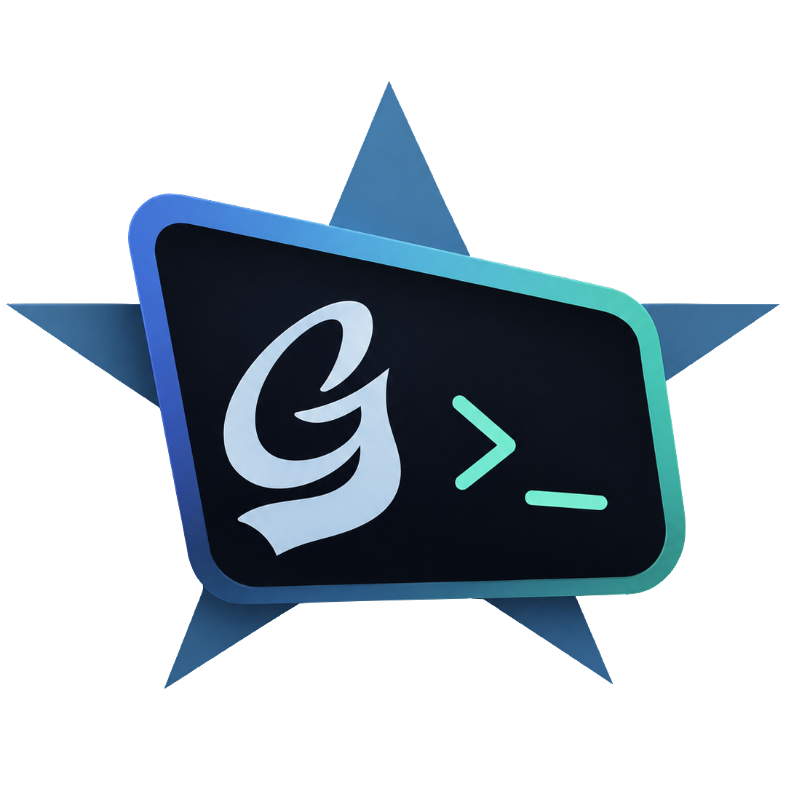

  

# Groovy Web Console

Visit https://groovyconsole.dev/ to try it out!

The Groovy Web Console lets you write, run, and share [Groovy](https://groovy-lang.org/)
scripts right from your browser — no local installation required. Your code is
executed by a cloud backend and the result is sent straight back to the editor.

You can:

* Run plain Groovy scripts as well as [Spock](https://spockframework.org/)
  specifications.
* Pick the Groovy version to run against (3, 4, 5, or 6).
* Inspect the Abstract Syntax Tree (AST) of your code.
* Save and share your scripts as GitHub gists, and browse your session history.

The sections below are for contributors who want to build, run, or deploy the
project locally.

## Backend

### Building the backend

Go to `functions/groovy-executor` and type `../../mvnw package`.
The output will be in `functions/groovy-executor/target/deployment`.

There are different profiles, one for each groovy version:

* `groovy_6_0`
* `groovy_5_1`
* `groovy_4_0` (default)
* `groovy_3_0`

Use `../../mvnw package -P groovy_5_1`

### Deploying the backend

Go to https://github.com/groovy-console/groovy-web-console/actions/workflows/deploy.yml and click on `Run Workflow`

## Frontend

### Building the frontend

You need to have Node 16 LTS installed.

1. Navigate to `services/frontend`
2. Install dependencies with `npm ci`
3. Build the frontend with `npm run build`

The output will be in `services/frontend/dist`.

### Running the frontend locally

Do the same steps as building the frontend but substitute the last command for:

 * `npm run serve-remote` to run the frontend with the remote backend
 * `npm run serve-local` to run the frontend with the local backend (start it with `../../mvnw function:run` from inside `functions/groovy-executor`)

### Checking code style

You can check the code style with `npm run lint` and automatically fix most issues with `npm run lint-fix`.

### Deploy App Engine web frontend

The web frontend consists only of static assets (HTML, JavaScript, and CSS).
Go to https://github.com/groovy-console/groovy-web-console/actions/workflows/deploy-frontend.yml and click on `Run Workflow`.

Alternatively, to deploy it manually after building it, go to the `services/frontend` directory, and type: `./deploy.sh`
